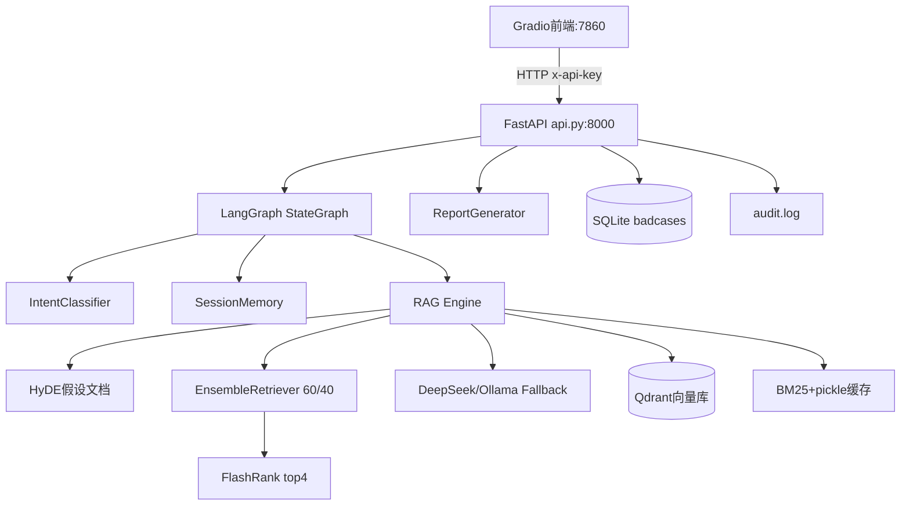

# AI 数字员工 · AI 应用开发面试指南

> 基于本项目 **AI-Digital-Employee-RAG** 整理的面试问答文档，涵盖项目概述、亮点难点、核心实现、50+ 面试题及参考答案、演示脚本与附录。

---

## 目录

- [第 1 章 项目概述](#第-1-章-项目概述)
- [第 2 章 项目亮点](#第-2-章-项目亮点)
- [第 3 章 项目难点与解决方案](#第-3-章-项目难点与解决方案)
- [第 4 章 核心模块实现详解](#第-4-章-核心模块实现详解)
- [第 5 章 面试题库（50+ 题）](#第-5-章-面试题库50-题)
  - [5.1 RAG 基础](#51-rag-基础12-题)
  - [5.2 LLM 应用工程](#52-llm-应用工程10-题)
  - [5.3 LangGraph / 工作流编排](#53-langgraph--工作流编排8-题)
  - [5.4 向量数据库与存储](#54-向量数据库与存储8-题)
  - [5.5 系统设计与工程化](#55-系统设计与工程化8-题)
  - [5.6 开放题 / 深挖题](#56-开放题--深挖题8-题)
- [第 6 章 常见追问链](#第-6-章-常见追问链)
- [第 7 章 面试演示脚本](#第-7-章-面试演示脚本)
- [第 8 章 附录](#第-8-章-附录)

---

## 第 1 章 项目概述

### 1.1 项目定位

**AI-Digital-Employee-RAG** 是一个基于 RAG（Retrieval-Augmented Generation，检索增强生成）的**本地知识库问答 + 学术报表生成系统**。用户可上传 PDF/Word、抓取网页入库，然后进行多轮对话问答、生成 5 类学术报表，并支持全自动量化评估。

**适用场景**：企业内部知识库、学术文献助手、论文写作辅助、客服知识问答（非 Agent 自主规划型）。

### 1.2 技术栈

| 层级 | 技术 |
|------|------|
| 后端 API | FastAPI + Uvicorn |
| 前端 UI | Gradio 5.x |
| 流程编排 | LangGraph StateGraph |
| RAG 框架 | LangChain 0.3.x |
| 大模型 | DeepSeek API / Ollama（本地 qwen2:7b） |
| 向量数据库 | Qdrant（Docker） |
| Embedding | BAAI/bge-small-zh-v1.5（512 维，CPU） |
| 混合检索 | 向量 MMR（60%）+ BM25（40%） |
| 重排序 | FlashRank（ms-marco-MiniLM-L-12-v2） |
| 检索增强 | HyDE（Hypothetical Document Embeddings） |
| 测试 | pytest + unittest.mock |
| CI | GitHub Actions + Ruff |

**说明**：本项目为 **Python 全栈**，不含 Spring Boot / Redis / Milvus。

### 1.3 核心能力矩阵

| 模块 | 能力 |
|------|------|
| 文档入库 | PDF（PyMuPDF4LLM）/ Word（python-docx）解析、分块、向量化 |
| 网页抓取 | trafilatura 正文提取、URL 去重、可选多语言翻译 |
| 多轮对话 | session_id 会话记忆、LangGraph 意图路由 |
| 报表生成 | summary / keypoints / review / comparison / custom 五类模板 |
| Word 导出 | Markdown → .docx |
| 自动评估 | 5 项量化指标 + CLI + Gradio 可视化 |
| LLM 容错 | 指数退避重试 + DeepSeek→Ollama Fallback |
| 链路追踪 | LangSmith（可选）+ 本地审计日志 |

### 1.4 系统架构



### 1.5 面试开场话术

**30 秒版**：

> 我做了一个基于 RAG 的 AI 数字员工系统，支持 PDF/网页知识库入库、多轮问答和学术报表生成。检索侧用了 HyDE + 向量/BM25 混合检索 + FlashRank 重排，编排层用 LangGraph 做意图路由，工程上做了 LLM 容错、全自动评估和 Qdrant 向量库生产化。

**3 分钟版**：

> **背景**：企业和学术场景需要基于私有文档的问答，直接微调成本高、更新慢，所以选 RAG。
>
> **架构**：Gradio 前端 + FastAPI 后端，核心问答走 LangGraph：先意图分类，闲聊跳过检索，知识类问题走 HyDE 增强 → 混合检索 → 重排 → LLM 生成，最后写回会话记忆。
>
> **亮点**：混合检索解决专有名词召回；HyDE 缓解短问题与长文档的 embedding 鸿沟；零 LLM 意图分类省 latency；LLM 重试+降级保证可用性；AutoEvaluator 五维量化评估。
>
> **难点**：Qdrant 与 BM25 双存储一致性、多次上传 BM25 覆盖 bug、FlashRank numpy 序列化、同步 RAG 不阻塞 FastAPI 事件循环。
>
> **成果**：5 类报表、5 项评估指标、完整 pytest CI，Docker Compose 一键部署 Qdrant。

---

## 第 2 章 项目亮点

### 亮点 1：HyDE 检索增强

| 维度 | 内容 |
|------|------|
| **是什么** | HyDE（Hypothetical Document Embeddings）：用 LLM 先把用户短问题扩展成 100–200 字的「假设文档」，再用该文档做向量检索 |
| **为什么** | 用户问题（短句）与知识库段落（长文）embedding 分布差异大，直接用问题检索召回率偏低 |
| **怎么实现** | `src/hyde.py` 中 `HyDE.generate()` 调用 LLM 生成百科/文献风格段落；失败时降级返回原问题；可通过 `HYDE_ENABLED=false` 关闭做 A/B 对比 |
| **面试话术** | 「我们在检索前加了一层 HyDE，把『迁移学习的优势是什么？』扩展成接近文献风格的段落再检索，召回明显提升，代价是每次多 1 次 LLM 调用约 1–3 秒，所以做成可配置开关。」 |

### 亮点 2：混合检索 + 重排

| 维度 | 内容 |
|------|------|
| **是什么** | 向量检索（MMR，权重 60%）+ BM25 关键词检索（权重 40%）融合后，FlashRank 重排取 top 4 |
| **为什么** | 向量检索语义好但可能漏专有名词/编号；BM25 精确匹配强；重排用 Cross-Encoder 精排提升最终上下文质量 |
| **怎么实现** | `src/rag.py` 中 `EnsembleRetriever(weights=[0.6, 0.4])` + `ContextualCompressionRetriever(base_compressor=FlashrankRerank(top_n=4))` |
| **面试话术** | 「我们不是单一路向量检索，而是 Ensemble 融合语义和关键词，再用 ms-marco 重排模型压缩到 4 段上下文，平衡召回和精度。」 |

### 亮点 3：BM25 累积修复 + pickle 缓存

| 维度 | 内容 |
|------|------|
| **是什么** | 修复多次上传文档后 BM25 只保留最后一批的 bug；重启后从 pickle 恢复 BM25 索引 |
| **为什么** | 原版 `init_retriever(new_docs)` 每次只用新文档重建 BM25，旧文档关键词检索失效 |
| **怎么实现** | `all_documents` 列表累积所有 chunk；`add_documents()` 追加后整体重建；`docs_cache.pkl` 持久化；启动时 `_try_load_cache()` 恢复 |
| **面试话术** | 「BM25 和 Qdrant 是双存储，我们遇到过多次上传后旧文档丢失的问题，通过 all_documents 累积 + pickle 缓存解决了，这也是我印象最深的 bug fix。」 |

### 亮点 4：LangGraph 显式工作流

| 维度 | 内容 |
|------|------|
| **是什么** | 用 LangGraph StateGraph 替代 api.py 中散落的 if-else 路由 |
| **为什么** | 意图分类、历史加载、RAG/闲聊、记忆保存职责清晰，便于扩展和测试 |
| **怎么实现** | `src/graph.py`：`classify → [chitchat | load_history → rag_ask] → save_memory → END` |
| **面试话术** | 「问答流程用 LangGraph 建模为有向图，每个节点 partial update state，依赖注入 rag/intent_classifier/session_memory，比过程式代码更易维护。」 |

### 亮点 5：零 LLM 意图分类

| 维度 | 内容 |
|------|------|
| **是什么** | 规则层（<1ms）+ Embedding 锚点相似度，不额外调用 LLM |
| **为什么** | LLM 分类每次多 0.1–0.3 秒和 API 费用，对简单四分类得不偿失 |
| **怎么实现** | `src/intent_classifier.py`：正则/关键词命中 70% 场景；未命中时用 bge 模型与预计算锚点句做余弦相似度；margin < 0.04 回退 knowledge_query |
| **面试话术** | 「闲聊走独立路径跳过检索，省掉 HyDE + 检索 + 重排的开销，分类本身零 LLM 成本。」 |

### 亮点 6：LLM 容错链

| 维度 | 内容 |
|------|------|
| **是什么** | 主模型 3 次指数退避重试 + DeepSeek 失败后自动切 Ollama 备用 |
| **为什么** | 网络超时、API 限流是生产常见问题，不能一次失败就挂 |
| **怎么实现** | `src/llm_factory.py`：`with_retry(retry_if_exception_type=网络异常, stop_after_attempt=3)` + `with_fallbacks([ollama])` |
| **面试话术** | 「用 LangChain 原生 RunnableRetry 和 RunnableWithFallbacks，完全兼容 LCEL 链式调用，对上层 rag.ask 透明。」 |

### 亮点 7：全自动评估体系

| 维度 | 内容 |
|------|------|
| **是什么** | 5 项量化指标替代人工 y/n 判断 |
| **为什么** | RAG 效果难量化，需要可复现的回归测试 |
| **怎么实现** | `src/evaluator.py` AutoEvaluator + `evaluate.py` CLI；指标：semantic_score、llm_judge、faithfulness、answer_relevance、latency p50/p90/p99 |
| **面试话术** | 「我们建了 30+ 条测试用例，语义相似度阈值 0.75，还有 LLM 裁判 0–3 分和忠实度幻觉检测，CI 里 evaluator 全 Mock 不依赖 GPU。」 |

### 亮点 8：Qdrant 生产化

| 维度 | 内容 |
|------|------|
| **是什么** | 从 ChromaDB 迁移到 Qdrant Docker 服务 |
| **为什么** | ChromaDB 进程内嵌入式，并发写入易文件锁，生产不可靠 |
| **怎么实现** | `src/vector_store.py`：QdrantClient HTTP 连接，COSINE 距离，512 维；对外接口不变，rag.py 零改动 |
| **面试话术** | 「向量库独立部署，支持并发读写和水平扩展，Collection 自动创建，Embedding 模型本地 CPU 推理。」 |

### 亮点 9：懒加载重型依赖

| 维度 | 内容 |
|------|------|
| **是什么** | langchain、torch、向量库等在函数内部 import，不在模块顶层 |
| **为什么** | 旧版 langchain_core 顶层 import 会触发 pydantic_v1 兼容问题；加快冷启动 |
| **怎么实现** | `rag.py`、`vector_store.py` 中 `init_retriever()`、`_build_embeddings()` 内部懒加载 |
| **面试话术** | 「这是 LangChain 生态常见的工程实践，测试时也可以更容易 mock 重型依赖。」 |

### 亮点 10：Grounded Prompt 防幻觉

| 维度 | 内容 |
|------|------|
| **是什么** | 强制 LLM 仅根据检索上下文回答，无信息则明确说「知识库中暂无此信息」 |
| **为什么** | RAG 最大风险是幻觉，必须约束生成边界 |
| **怎么实现** | `rag.py` ask() 中 prompt：「请仅根据[参考信息]回答问题…禁止猜测」；检索为空时直接返回固定文案 |
| **面试话术** | 「我们同时在 prompt 层和 retrieval 层做约束：没检索到就不调 LLM 瞎编，检索到了也明确要求 grounded。」 |

---

## 第 3 章 项目难点与解决方案

### 难点 1：双存储一致性（Qdrant + BM25）

| STAR | 内容 |
|------|------|
| **Situation** | 向量存在 Qdrant（Docker 持久化），BM25 索引在内存中，重启后 BM25 丢失 |
| **Task** | 保证重启后混合检索仍可用，多次上传不丢旧文档 |
| **Action** | `all_documents` 累积所有 chunk；pickle 写入 `./rag_cache/docs_cache.pkl`；启动 `_try_load_cache()` 同步恢复 `all_documents` 和 BM25 |
| **Result** | 重启无需重新上传；BM25 与向量侧文档集合一致（在 pickle 正常时） |
| **源码** | `src/rag.py` L80–105, L138–142 |
| **追问** | 「如果 pickle 丢了但 Qdrant 还在？」→ 向量检索仍可用，BM25 关键词检索缺失，需从 Qdrant 回扫重建 BM25（当前未实现，是已知技术债） |

### 难点 2：问题-文档 embedding 鸿沟

| STAR | 内容 |
|------|------|
| **Situation** | 用户问「ResNet 优势？」，知识库是长段落，短问题 embedding 与文档 embedding 空间不对齐 |
| **Task** | 提升向量检索召回率 |
| **Action** | 引入 HyDE：LLM 生成 100–200 字假设文档再检索；失败降级原问题 |
| **Result** | 召回率提升（可通过 evaluate.py 对比 HYDE_ENABLED true/false 量化） |
| **源码** | `src/hyde.py`, `src/rag.py` L193–199 |
| **追问** | 「HyDE 会不会引入幻觉检索？」→ 假设文档仅用于检索 query 变换，最终回答仍基于真实检索 chunk + grounded prompt |

### 难点 3：多用户会话隔离

| STAR | 内容 |
|------|------|
| **Situation** | LangChain ConversationBufferMemory 绑定单一 chain，难按 session_id 隔离 |
| **Task** | 支持多用户多轮对话，理解指代（「刚才那个方法呢？」） |
| **Action** | 自实现 `SessionMemory`：Dict[session_id → Session] + threading.Lock；TTL 30 分钟；最多 5 轮；`to_history_text()` 注入 prompt |
| **Result** | 多 session 并发安全；历史答案截断 200 字控制 token |
| **源码** | `src/memory.py`, `src/graph.py` node_load_history / node_save_memory |
| **追问** | 「为什么不用 Redis？」→ 当前单机 MVP，内存足够；注释中预留 SQLite/Redis 扩展用户画像 |

### 难点 4：FlashRank numpy 序列化

| STAR | 内容 |
|------|------|
| **Situation** | FlashRank 在 metadata 注入 numpy.float32，API 返回 JSON 报错 |
| **Task** | sources 字段可正常序列化返回前端 |
| **Action** | 提取纯函数 `sanitize_metadata()`，递归将 numpy 类型转为 Python 原生 |
| **Result** | `/ask` 响应 sources 正常；函数可单测 |
| **源码** | `src/rag.py` L20–37, L252–260 |

### 难点 5：同步 RAG 阻塞 FastAPI 事件循环

| STAR | 内容 |
|------|------|
| **Situation** | RAG 调 LLM 需数秒到数十秒，同步调用会阻塞 async 事件循环 |
| **Task** | 保持 FastAPI 异步架构，同时跑重 CPU/IO 操作 |
| **Action** | `ThreadPoolExecutor(max_workers=4)` + `asyncio.run_in_executor()` 包裹 ask_graph.invoke、upload、crawl |
| **Result** | 并发请求不被单个 RAG 阻塞 |
| **源码** | `src/api.py` L18, 及 `/ask` 等路由实现 |

### 难点 6：LLM 不稳定

| STAR | 内容 |
|------|------|
| **Situation** | DeepSeek API 偶发超时、限流 |
| **Task** | 保证服务可用性 |
| **Action** | 主模型 with_retry(3 次, 指数退避+jitter) + with_fallbacks(Ollama)；TEMPERATURE=0.0 确定性输出 |
| **Result** | API 故障时自动降级本地模型 |
| **源码** | `src/llm_factory.py` |

### 难点 7：评估主观性

| STAR | 内容 |
|------|------|
| **Situation** | 早期 evaluate 需人工 y/n，无法 CI 回归 |
| **Task** | 全自动、多维度量化 |
| **Action** | AutoEvaluator：Embedding 语义相似度 + LLM 裁判 0–3 + 忠实度 + 相关度 + 延迟百分位 |
| **Result** | `evaluate.py --no-llm-judge` 可快速跑；报告 JSON 供 Gradio 可视化 |
| **源码** | `src/evaluator.py`, `evaluate.py`, `test/test_cases.json` |

### 难点 8：PDF 结构保留

| STAR | 内容 |
|------|------|
| **Situation** | 纯文本提取丢失标题层级和表格，影响分块质量 |
| **Task** | 保留文档结构以利于检索 |
| **Action** | pymupdf4llm 转 Markdown → MarkdownHeaderTextSplitter 按 #/## 切分 → RecursiveCharacterTextSplitter(800/150) |
| **Result** | chunk 语义更完整，metadata 标记 has_table |
| **源码** | `src/document_loader.py` |

---

## 第 4 章 核心模块实现详解

### 4.1 RAG 检索管线（`src/rag.py`）

**完整数据流**：

```
用户问题
  → HyDE.generate()（可选，失败→原问题）
  → final_retriever.invoke()
      → EnsembleRetriever
          → 向量 MMR (k=RETRIEVAL_TOP_K=10, weight=0.6)
          → BM25 (k=5, weight=0.4)
      → FlashrankRerank (top_n=RERANK_TOP_K=4)
  → 拼接 context
  → Prompt + LLM + StrOutputParser
  → sanitize_metadata(sources)
```

**关键代码逻辑**：

```python
# 混合检索 + 重排
ensemble_retriever = EnsembleRetriever(
    retrievers=[vector_retriever, bm25_retriever],
    weights=[0.6, 0.4]
)
compressor = FlashrankRerank(model=settings.RERANK_MODEL_NAME, top_n=settings.RERANK_TOP_K)
self.final_retriever = ContextualCompressionRetriever(
    base_compressor=compressor,
    base_retriever=ensemble_retriever
)
```

**Prompt 结构**：

```
你是一个专业的 AI 数字员工助手。请仅根据[参考信息]回答问题。
如果参考信息中没有相关内容，请直接说"知识库中暂无此信息"，禁止猜测。
{history}          ← 可选，来自 SessionMemory
[参考信息]
{context}          ← top 4 重排后的 chunk
[用户问题]
{input}
```

**LCEL 链**：`prompt | self.llm | StrOutputParser()`，配合 `get_run_config()` 接入 LangSmith。

### 4.2 LangGraph 问答工作流（`src/graph.py`）

**AskState 字段**：

| 字段 | 来源节点 | 说明 |
|------|----------|------|
| question, session_id | 输入 | 用户问题与会话 ID |
| intent, confidence, method | classify | 意图分类结果 |
| history | load_history | 历史对话文本 |
| answer, sources, provider | rag_ask / chitchat | 生成结果 |

**节点职责**：

1. **classify**：调用 `IntentClassifier.classify()`
2. **load_history**：`session_memory.get_history(session_id)`
3. **rag_ask**：`rag.ask(question, history)` — 完整 RAG
4. **chitchat**：`rag.chitchat(question)` — 跳过检索
5. **save_memory**：`session_memory.add_turn()` — 汇聚节点

**路由**：`route_by_intent()` — chitchat → chitchat 节点；其他 → load_history → rag_ask。

**编译**：`build_ask_graph(rag, intent_classifier, session_memory)` 在 lifespan 启动时调用一次，全局复用 `ask_graph`。

### 4.3 文档入库（`src/document_loader.py` + `src/web_scraper.py`）

**PDF 流程**：

1. `pymupdf4llm.to_markdown()` 主路径（保留标题/表格）
2. 失败降级 `fitz` 纯文本
3. `MarkdownHeaderTextSplitter` 按 `#`/`##` 切分
4. `RecursiveCharacterTextSplitter(chunk_size=800, overlap=150, separators=["\n\n","\n","。","！","？"," ",""])`
5. metadata：`source`, `chunk_id`, `file_type`, `has_table`

**Word 流程**：python-docx 遍历 body，Heading → Markdown 标题，表格 → Markdown 表格，再走统一分片。

**网页流程**（`WebScraper`）：

- trafilatura 提取正文
- `URLStore` SHA256 去重（`crawled_urls.json`）
- 可选 `Translator` 翻译非中文（需 `TRANSLATION_ENABLED=true`）
- 仅 RecursiveCharacterTextSplitter（无标题分片）

**入库 API**（`api.py`）：

- `/upload`：临时文件 → DocumentLoader → VectorStore.add_documents + rag.add_documents
- `/crawl`：WebScraper.scrape → 同上

### 4.4 意图分类（`src/intent_classifier.py`）

**四类意图**：

| 意图 | 路由 | 说明 |
|------|------|------|
| chitchat | 跳过 RAG | 问候、闲聊 |
| knowledge_query | 完整 RAG | 学术/知识查询（默认） |
| operation | 完整 RAG | 操作指引类 |
| complaint | 完整 RAG + 标签 | 投诉类（供 BadCase 分析） |

**两层策略**：

1. **规则层**：正则 + 关键词，投诉词优先
2. **Embedding 层**：与 `_INTENT_ANCHORS` 预计算锚点做平均余弦相似度；top1 与 top2 差距 < 0.04 时回退 knowledge_query

**优化**：启动时 `_precompute_anchors()` 一次性 embed 锚点句，分类时只做向量运算。

### 4.5 会话记忆（`src/memory.py`）

**参数**：

- `DEFAULT_MAX_TURNS = 5`
- `DEFAULT_TTL_SECONDS = 1800`（30 分钟）

**核心方法**：

- `add_turn(session_id, question, answer, intent)` — 追加并 trim
- `get_history(session_id)` → `Session.to_history_text()` — 格式化注入 prompt
- `_cleanup_expired()` — TTL 过期清理

**设计取舍**：不用 LangChain Memory，因为多 session 隔离和线程安全更可控。

### 4.6 评估引擎（`src/evaluator.py` + `evaluate.py`）

**五项指标**：

| 指标 | 方法 | 阈值/范围 |
|------|------|-----------|
| semantic_score | answer vs ground_truth Embedding 余弦 → 映射 [0,1] | ≥ 0.75 视为正确 |
| answer_relevance | answer vs question 语义相似度 | 0~1 |
| llm_judge_score | LLM 打 0–3 分 | 0=错, 3=完全正确 |
| faithfulness | LLM 判断 answer 声明在 sources 中的占比 | 0~1，需 sources |
| latency_ms | 端到端耗时 | p50/p90/p99 |

**CLI 用法**：

```bash
python evaluate.py --key your-key                    # 完整评估
python evaluate.py --key your-key --no-llm-judge     # 跳过 LLM 裁判
python evaluate.py --key your-key --threshold 0.8    # 自定义阈值
```

**输出**：`test/evaluation_report.json`，Gradio「系统评估」Tab 可视化。

---

## 第 5 章 面试题库（50+ 题）

> 每题采用 **通用答案 + 本项目实践** 双轨回答。

---

### 5.1 RAG 基础（12 题）

#### Q1：什么是 RAG？为什么需要 RAG 而不是直接微调？

**通用答案**：RAG 在生成前先从外部知识库检索相关文档，将检索结果作为上下文注入 LLM，使回答 grounded 于私有数据。相比微调：成本低、更新快（上传即生效）、可溯源、无需 GPU 训练。

**本项目实践**：用户上传 PDF/Word 或抓取网页 → Qdrant 向量化 + BM25 索引 → `/ask` 检索 top 4 chunk → grounded prompt 生成。知识更新只需重新 upload，无需重训模型。

---

#### Q2：向量检索和关键词检索各有什么优缺点？你们怎么融合？

**通用答案**：
- **向量检索**：语义相似，擅长同义表达；弱于精确匹配专有名词、编号、公式
- **BM25**：精确关键词匹配强；弱于语义理解和同义词

**本项目实践**：`EnsembleRetriever` 向量 60% + BM25 40%，再用 FlashRank Cross-Encoder 重排 top 4。BM25 侧用 `all_documents` 累积 + pickle 缓存。

---

#### Q3：什么是 HyDE？原理和代价是什么？

**通用答案**：HyDE（Hypothetical Document Embeddings）先用 LLM 生成假设答案文档，再用该文档 embedding 检索。原理是假设文档与真实文档 embedding 空间更接近。代价：每次问答多 1 次 LLM 调用，增加 1–3 秒延迟和 token 成本。

**本项目实践**：`src/hyde.py`，100–200 字百科/文献风格段落；`HYDE_ENABLED` 可关闭；失败降级原问题。

---

#### Q4：MMR 检索和普通 Top-K 有什么区别？

**通用答案**：MMR（Maximal Marginal Relevance）在相关性和多样性间权衡，避免 top-K 结果高度重复（如多个 chunk 来自同一章节）。公式：MMR = argmax[λ·Sim(q,d) - (1-λ)·max Sim(d,di)]。

**本项目实践**：Qdrant retriever 使用 MMR，`k=RETRIEVAL_TOP_K=10`，作为混合检索的向量侧输入。

---

#### Q5：重排序（Rerank）为什么必要？放在检索链路的什么位置？

**通用答案**：Bi-Encoder（向量/BM25）召回快但精度有限；Cross-Encoder Rerank 对 query-document 对做精细打分，精度高但慢，适合对少量候选精排。应放在召回之后、LLM 生成之前。

**本项目实践**：Ensemble 召回 → `FlashrankRerank(ms-marco-MiniLM-L-12-v2, top_n=4)` → 注入 prompt。报表生成同样走 RAG 检索但未用 HyDE。

---

#### Q6：Chunk Size 和 Overlap 如何选择？

**通用答案**：
- **Chunk Size**：太小丢上下文，太大引入噪声、超 token 限制。中文学术文档常用 500–1000 字
- **Overlap**：避免语义在边界被切断，通常 10%–20%

**本项目实践**：`CHUNK_SIZE=800`, `CHUNK_OVERLAP=150`（约 19%）。PDF/Word 先按 Markdown 标题切分再递归字符切分，保留结构。

---

#### Q7：Embedding 模型选型考虑哪些因素？

**通用答案**：语言匹配（中文用 bge/m3e 等）、维度与存储成本、推理速度、是否在 MTEB/C-MTEB 榜单表现好、是否支持 normalize。

**本项目实践**：`BAAI/bge-small-zh-v1.5`，512 维，CPU 推理，`normalize_embeddings=True`，COSINE 距离。本地 `./models/` 离线加载，镜像站 `hf-mirror.com` 加速。

---

#### Q8：如何减少 RAG 幻觉？

**通用答案**：
1. Grounded prompt（仅根据上下文回答）
2. 检索为空时不生成
3. 重排提升上下文质量
4. 忠实度评估监控
5. 低 temperature

**本项目实践**：prompt 明确「禁止猜测」；无检索结果返回固定文案；`TEMPERATURE=0.0`；AutoEvaluator faithfulness 指标；sources 返回 content_excerpt 供前端展示和评估。

---

#### Q9：RAG 的评估指标有哪些？

**通用答案**：检索侧（Recall@K、MRR、nDCG）；生成侧（语义相似度、BLEU/ROUGE 参考性弱）；RAG 专用（RAGAS 的 faithfulness、answer_relevance、context_precision）；人工评估；LLM-as-Judge。

**本项目实践**：5 项——semantic_score、answer_relevance、llm_judge(0–3)、faithfulness、latency p50/p90/p99。测试集 `test/test_cases.json` 约 30+ 条学术 QA。

---

#### Q10：知识库为空时如何处理？

**通用答案**：应在检索层和 API 层做防御——不调用 LLM 或返回引导文案，避免幻觉。

**本项目实践**：`rag.ask()` 检查 `final_retriever is None` 时返回「知识库为空，请先上传 PDF 文档或采集网页内容」；检索结果为空时返回「抱歉，知识库中未找到相关内容」。

---

#### Q11：多路检索权重 60/40 是怎么确定的？

**通用答案**：通常通过离线评估集网格搜索或 A/B 测试确定。经验上向量侧权重略高（语义为主），BM25 作为补充（10%–40%）。

**本项目实践**：默认 60/40 是经验值，可通过修改 `rag.py` 中 `weights=[0.6, 0.4]` 调整；建议用 `evaluate.py` 对比不同权重下的 semantic_score 和 faithfulness。

---

#### Q12：BM25 和向量检索在什么场景下互补？

**通用答案**：
- BM25 强：型号编号（E05）、英文缩写、罕见专有名词、精确术语
- 向量强：同义改写、概括性提问、跨语言语义（若 embedding 支持）

**本项目实践**：学术场景如「ResNet 和 VGG 区别」向量好；「第 3.2 节实验设置」BM25 可能更准。混合检索覆盖两类。

---

### 5.2 LLM 应用工程（10 题）

#### Q13：Prompt 工程设计有哪些原则？

**通用答案**：角色明确、任务清晰、输出格式约束、Few-shot 示例、边界条件（不知道怎么说）、分隔符结构化输入、避免歧义。

**本项目实践**：
- RAG：`[参考信息]` + `[用户问题]` + 禁止猜测
- HyDE：100–200 字、禁止客套话
- 报表：5 类模板含 Markdown 结构要求
- LLM 裁判：固定 `SCORE: / REASON:` 格式便于解析

---

#### Q14：为什么 Temperature 设为 0？

**通用答案**：Temperature=0 使输出确定性最高，减少随机性，适合 factual QA 和评估可复现性。创意写作可用 0.7–1.0。

**本项目实践**：`settings.TEMPERATURE=0.0`，问答和报表均追求准确稳定。

---

#### Q15：LLM Fallback 策略怎么设计？

**通用答案**：主备模型切换条件（超时、5xx、rate limit）；备模型能力应接近主模型；记录降级事件；备模型也应有重试。

**本项目实践**：DeepSeek 主 → Ollama qwen2:7b 备；`with_fallbacks([fallback])`；Ollama 构建失败则仅主模型并 warning 日志。

---

#### Q16：重试与幂等性怎么考虑？

**通用答案**：仅对 transient 错误重试（网络超时、连接失败）；指数退避 + jitter 防惊群；写操作需幂等 key；读操作（问答）重试相对安全但可能重复计费。

**本项目实践**：`_RETRYABLE = (ConnectionError, TimeoutError, OSError, httpx.TimeoutException)`；`stop_after_attempt=3, wait_exponential_jitter=True`。问答无写库副作用（除 session memory 和 audit log）。

---

#### Q17：如何控制 Token 成本？

**通用答案**：减少 HyDE/多轮调用、压缩 context、限制 max_tokens、缓存 embedding、用小模型做分类/重排、批处理。

**本项目实践**：意图分类零 LLM；历史答案截断 200 字；重排后仅 4 chunk；`--no-llm-judge` 快速评估；HyDE 可关；闲聊跳过检索。

---

#### Q18：DeepSeek vs Ollama 怎么选型？

**通用答案**：DeepSeek：效果好、低延迟（API）、有成本、需网络。Ollama：免费本地、数据不出域、需 GPU/CPU 资源、效果取决于模型大小。

**本项目实践**：`LLM_PROVIDER` 切换；开发可用 DeepSeek 快速迭代，离线/隐私场景用 Ollama；Fallback 保证 API 挂时有本地兜底。

---

#### Q19：LangChain LCEL 链式调用是什么？

**通用答案**：LCEL（LangChain Expression Language）用 `|` 管道符组合 Runnable：`prompt | llm | parser`。支持 stream、batch、parallel、config（callbacks/tracing）。

**本项目实践**：
```python
chain = prompt | self.llm | StrOutputParser()
answer = chain.invoke(question, config=get_run_config(...))
```
HyDE、chitchat、evaluator 均用同一模式。

---

#### Q20：如何实现流式输出？本项目做了吗？

**通用答案**：LLM `stream()` 或 LCEL `chain.stream()`，SSE/WebSocket 推送到前端，改善首 token 延迟体验。

**本项目实践**：**当前未实现**，`/ask` 返回完整 JSON。扩展方案：FastAPI `StreamingResponse` + `chain.astream()` + Gradio 流式 Chatbot。面试可主动说「这是已知改进点」。

---

#### Q21：Function Calling / Agent 与本项目的区别？

**通用答案**：Function Calling 让 LLM 选择预定义工具（搜索、计算器、API）；Agent 是多步规划+工具循环（ReAct）。RAG 是固定流水线：检索→生成。

**本项目实践**：**不是 Agent 架构**。LangGraph 用于工作流编排（意图路由），无 `bind_tools`、无 ReAct 循环。报表/问答路径固定。扩展 Agent 可加工具节点：如「实时搜索」「代码执行」。

---

#### Q22：如何设计「不知道就说不知道」的 Prompt？

**通用答案**：明确指令 + 负向约束（禁止猜测/编造）+ 检索为空时的程序化处理 + 示例。

**本项目实践**：
```
请仅根据[参考信息]回答问题。
如果参考信息中没有相关内容，请直接说"知识库中暂无此信息"，禁止猜测。
```
代码层：无 retriever / 无 docs 时不进入生成链。

---

### 5.3 LangGraph / 工作流编排（8 题）

#### Q23：LangGraph 和普通 if-else 路由有什么区别？

**通用答案**：LangGraph 将流程建模为有向图，节点/边/条件边显式声明；支持状态管理、检查点、并行、可视化；比嵌套 if-else 更易扩展和测试。

**本项目实践**：原 api.py 过程式逻辑迁移到 `graph.py` 五节点 StateGraph，条件边 `route_by_intent` 分流 chitchat/RAG。

---

#### Q24：StateGraph 状态怎么设计？

**通用答案**：TypedDict 定义所有字段；节点只返回 partial update；避免节点间隐式共享 mutable 对象；输入/中间/输出字段分离。

**本项目实践**：`AskState` 含 question/session_id（输入）、intent/confidence/method（分类）、history（记忆）、answer/sources/provider（输出）。

---

#### Q25：条件边和普通边的区别？

**通用答案**：普通边 A→B 固定流转；条件边 A→[B|C|D] 由路由函数根据 state 动态选择。

**本项目实践**：`add_conditional_edges("classify", route_by_intent, {"load_history": ..., "chitchat": ...})`；其余为普通边。

---

#### Q26：节点 partial update 机制是什么？

**通用答案**：LangGraph 自动 merge 节点返回值到 state，节点无需返回完整 state，只返回变更字段。

**本项目实践**：`node_classify` 只返回 `{intent, confidence, method}`；`node_save_memory` 返回 `{}` 不修改 state。

---

#### Q27：本项目为什么不用 Agent？

**通用答案**：业务场景是固定知识库 QA + 模板报表，不需要 LLM 自主选工具和多步规划。固定 RAG 流水线更可控、延迟可预测、评估更简单。

**本项目实践**：LangGraph 做轻量编排（意图+记忆），非 ReAct Agent。面试正面表述：「当前需求不需要 Agent 的灵活性，RAG 流水线 ROI 更高；Agent 可作为二期扩展。」

---

#### Q28：闲聊路径跳过 RAG 的设计理由？

**通用答案**：闲聊不需要知识库；跳过 HyDE+检索+重排可省 2–5 秒和 embedding 计算；避免无关 chunk 污染 prompt。

**本项目实践**：`intent == "chitchat"` → `node_chitchat` → `rag.chitchat()` 直接 LLM，sources 为空。

---

#### Q29：如何将 LangSmith 接入追踪？

**通用答案**：设置 `LANGCHAIN_TRACING_V2=true`、`LANGCHAIN_API_KEY`、project name；在 chain.invoke 传 config；可在 Smith UI 看每步 latency 和 token。

**本项目实践**：`src/tracing.py` 的 `setup_tracing()` 在 lifespan 最先调用；`get_run_config(run_name, metadata)` 用于 retriever 和 answer-generation；HyDE 单独 `run_name="HyDE.generate"`。

---

#### Q30：工作流如何单元测试？

**通用答案**：Mock 各节点依赖（rag、classifier、memory）；直接 invoke graph 断言 state；或单测各节点函数。

**本项目实践**：`tests/test_memory.py` 测 SessionMemory；graph 可通过 mock rag.ask/chitchat 测路由；evaluator 全 Mock 无 GPU。

---

### 5.4 向量数据库与存储（8 题）

#### Q31：Qdrant vs Milvus vs ChromaDB 怎么选？

**通用答案**：
- **ChromaDB**：嵌入式、开发快、并发弱
- **Qdrant**：Rust、HTTP 服务、过滤强、Docker 友好、中小规模生产常用
- **Milvus**：大规模分布式、运维复杂

**本项目实践**：从 ChromaDB 迁到 Qdrant，解决文件锁和并发问题；单机 Docker 部署，Collection `knowledge_base`，COSINE + 512 维。

---

#### Q32：COSINE 距离 vs L2（欧氏距离）？

**通用答案**：COSINE 衡量方向相似性，对向量长度不敏感，适合 normalize 后的 embedding。L2 衡量绝对距离，normalize 后与 COSINE 等价。

**本项目实践**：`Distance.COSINE` + `normalize_embeddings=True`，语义检索标准配置。

---

#### Q33：向量维度 512 的含义？

**通用答案**：每个文本 chunk 被映射为 512 维浮点向量；维度由 Embedding 模型决定；更高维可能更精细但存储和计算成本更高。

**本项目实践**：bge-small-zh-v1.5 固定 512 维；`EMBEDDING_DIM=512` 须与模型一致，否则 Qdrant Collection 创建报错。

---

#### Q34：双存储（Qdrant + BM25）一致性方案？

**通用答案**：理想方案是统一 document store，BM25 和向量索引都从同一源重建；或事件驱动同步；至少保证 add/delete 操作原子化。

**本项目实践**：upload 时同时 `VectorStore.add_documents()` + `rag.add_documents()`；BM25 用 pickle 缓存；**风险**：pickle 丢失则 BM25 不完整。改进：从 Qdrant scroll 全量重建 BM25。

---

#### Q35：pickle 缓存的风险与替代方案？

**通用答案**：pickle 不安全（不可信来源可 RCE）、版本不兼容、与 Qdrant 可能不同步。替代：JSON/Parquet 存原文、SQLite 存 chunk、Redis、或每次从 Qdrant 重建。

**本项目实践**：`docs_cache.pkl` 存 Document 列表供 BM25 恢复；MVP 阶段简单有效；生产建议换结构化存储 + 版本号。

---

#### Q36：会话记忆为什么不持久化？

**通用答案**：MVP 优先简单；会话 TTL 30 分钟可接受丢失；持久化需 Redis/SQLite + 序列化 + 清理策略。

**本项目实践**：`SessionMemory` 纯内存 + Lock；重启丢失；注释预留 Redis 做用户画像。BadCase 反馈已用 SQLite 持久化。

---

#### Q37：BadCase SQLite 存储设计？

**通用答案**：收集用户 thumbs down 的 QA 对，用于分析、微调数据、prompt 迭代。

**本项目实践**：`src/badcase_store.py`，`./rag_cache/badcases.db`；`/feedback` 接口存 question/answer/intent/sources/note；`/feedback/badcases` 查询。

---

#### Q38：Docker 部署 Qdrant 注意事项？

**通用答案**：数据卷持久化、健康检查、端口 6333/6334、内存限制、备份 snapshot、生产用 Qdrant Cloud 或集群。

**本项目实践**：`docker-compose.yml` 用 `qdrant/qdrant:v1.15.1`，`./qdrant_storage` 挂载，healthcheck `curl localhost:6333/healthz`；api 服务 depends_on qdrant healthy。

---

### 5.5 系统设计与工程化（8 题）

#### Q39：FastAPI 异步 + 线程池模式怎么理解？

**通用答案**：FastAPI 路由 async 但 CPU/阻塞 IO（LLM、embedding）会阻塞事件循环；用 `run_in_executor` 把同步代码放线程池。

**本项目实践**：`ThreadPoolExecutor(max_workers=4)`，`await loop.run_in_executor(executor, ask_graph.invoke, state)` 处理 `/ask`、upload、crawl。

---

#### Q40：API 鉴权 x-api-key 设计？

**通用答案**：简单 API Key 适合内部服务/MVP；生产应 HTTPS + Key 轮换 + Rate Limit + 更细粒度 RBAC。

**本项目实践**：`Depends(verify_api_key)` 比对 Header `x-api-key` 与 `settings.API_KEY`；`/health` 和 `/report/types` 无需鉴权。

---

#### Q41：审计日志怎么做的？

**通用答案**：记录请求/响应摘要、latency、user/session、intent，滚动文件防膨胀，便于排障和合规。

**本项目实践**：`src/audit_log.py`，RotatingFile `./rag_cache/audit.log`；`Timer` 上下文管理器测耗时；`/ask` 和 `/report` 后 `record()`。

---

#### Q42：多轮对话 session_id 设计？

**通用答案**：前端生成 UUID 传 session_id；后端按 key 存历史；清空会话 DELETE；无 session 则单轮。

**本项目实践**：Gradio 生成 UUID；`POST /ask` 带 session_id；`DELETE /session/{id}` 清除；`GET /session/stats` 统计活跃数。

---

#### Q43：上传文件大小限制与安全？

**通用答案**：限制大小、校验扩展名、病毒扫描（生产）、临时目录存储、不执行上传内容、防路径遍历。

**本项目实践**：`MAX_UPLOAD_SIZE=10MB`；仅 `.pdf`/`.docx`；`tempfile` 暂存后解析删除；`DocumentLoader` 校验后缀。

---

#### Q44：CI 测试策略？

**通用答案**：单元测试 Mock 外部依赖；集成测试用 testcontainers；E2E 评估单独 pipeline；lint + type check。

**本项目实践**：`.github/workflows/ci.yml`：pytest + ruff；tests 全 Mock（不装 torch/langchain 重型包）；evaluator/memory/config/audit_log/docx_exporter 覆盖。

---

#### Q45：配置管理 pydantic-settings？

**通用答案**：类型安全、.env 自动加载、默认值集中、环境变量覆盖、Literal 枚举校验。

**本项目实践**：`src/config.py` 的 `Settings` 类，`.env` 管理 LLM_PROVIDER、HyDE、Qdrant、API_KEY 等；修改配置无需改代码。

---

#### Q46：生产部署架构？

**通用答案**：前端 CDN/独立容器、API 多副本、Qdrant 集群、Ollama GPU 节点、Nginx 反代、监控告警。

**本项目实践**：`docker-compose.yml` 三服务 qdrant + ollama + api；**Gradio 未容器化**需单独 `python app_gradio.py`；Dockerfile 非 root 用户 `appuser` 运行 uvicorn。

---

### 5.6 开放题 / 深挖题（8 题）

#### Q47：检索召回率低怎么排查？

**通用答案**：
1. 检查 chunk 质量和大小
2. 检查 embedding 模型语言匹配
3. 对比 HyDE 开/关
4. 调高 RETRIEVAL_TOP_K
5. 检查 BM25 索引是否完整
6. 用 LangSmith 看检索到的 doc
7. 分析 badcase

**本项目实践**：`/health` 看文档块数；对比 pickle 缓存与 Qdrant count；evaluate 按 category 看 semantic_score；调 weights 和 top_k。

---

#### Q48：如何优化 HyDE 带来的延迟？

**通用答案**：缓存相似问题的 HyDE 结果；仅复杂/短问题启用 HyDE；用小模型做 HyDE；异步并行 HyDE 与 BM25（BM25 不依赖 HyDE）；批量预计算。

**本项目实践**：`HYDE_ENABLED=false` 直接省 1 次 LLM；意图分类后闲聊不走 HyDE；可考虑「问题长度 < N 才 HyDE」规则。

---

#### Q49：如何实现流式回答？

**通用答案**：`chain.astream()` + SSE；Gradio 支持流式 Chatbot；需注意 sources 在流结束后返回。

**本项目实践**：当前同步返回；扩展 `/ask/stream` endpoint，`StreamingResponse(event_generator)`。

---

#### Q50：如何支持多租户知识库隔离？

**通用答案**：Qdrant payload filter 按 tenant_id；Collection  per tenant；上传时打 tenant 标签；检索时 filter。

**本项目实践**：当前单租户全局 `knowledge_base` Collection；扩展：metadata 加 `tenant_id` + retriever search_kwargs filter。

---

#### Q51：如何实现 Agent + Tool Calling 扩展？

**通用答案**：LangGraph 加 tool 节点；LLM bind_tools；ReAct 循环：思考→选工具→执行→观察→再思考。

**本项目实践**：可在 graph 中加 `node_tool_route`：如实时搜索、计算器、SQL 查询；与现有 RAG 路径并行。当前固定流水线是有意取舍。

---

#### Q52：网页 JS 渲染页面抓取方案？

**通用答案**：trafilatura/requests 无法渲染 JS；用 Playwright/Puppeteer headless browser；或调用 Jina Reader / Firecrawl API。

**本项目实践**：`trafilatura` 主路径 + requests 降级；`.env.example` 注释提到 browser 但未实现；SPA 页面效果差是已知局限。

---

#### Q53：如何引入 Redis 持久化会话？

**通用答案**：Session 序列化 JSON 存 Redis，key=`session:{id}`，TTL 1800s；多 API 副本共享；用 Redis Hash 存 turns 列表。

**本项目实践**：替换 `SessionMemory._sessions` Dict 为 Redis client；接口不变；用户画像也可放 Redis Hash。

---

#### Q54：项目最大的技术债是什么？

**诚实回答**：
1. **BM25/Qdrant 双存储不一致风险**（pickle 丢失时 BM25 缺失）
2. **upload 时新建 VectorStore()** 重复加载 Embedding 模型（应复用 rag.vector_store）
3. **BM25 k=5 硬编码**，未走 config
4. **会话记忆仅内存**，重启丢失
5. **无流式输出**
6. **Translator import 路径**（`from src.rag import get_llm` 可能有问题，应走 llm_factory）
7. **complaint 意图无专门话术**，与 knowledge_query 同路径
8. **README 列了 `/translate` 接口但代码未暴露**（翻译内嵌在 crawl 流程）

---

## 第 6 章 常见追问链

### 追问链 1：检索体系

```
「你们怎么做检索？」
  → 混合检索：向量 MMR + BM25，权重 60/40
    → 「为什么 60/40？」→ 向量语义为主，BM25 补专有名词
      → 「BM25 数据从哪来？」→ all_documents 累积所有 chunk
        → 「重启怎么办？」→ pickle 缓存 docs_cache.pkl
          → 「遇到过什么 bug？」→ 多次 upload 后旧文档 BM25 丢失
            → 「怎么修的？」→ add_documents extend 而非 replace
```

### 追问链 2：HyDE

```
「HyDE 是什么？」
  → LLM 生成假设文档再检索
    → 「为什么有效？」→ 短问题 vs 长文档 embedding 鸿沟
      → 「代价？」→ 多 1 次 LLM，1–3 秒
        → 「怎么控制成本？」→ HYDE_ENABLED 开关；闲聊不走 RAG
          → 「失败呢？」→ 降级用原问题
```

### 追问链 3：LangGraph

```
「为什么用 LangGraph？」
  → 显式工作流，比 if-else 清晰
    → 「是 Agent 吗？」→ 不是，是固定流水线编排
      → 「有哪些节点？」→ classify / load_history / rag_ask / chitchat / save_memory
        → 「怎么测试？」→ mock rag + 断言 state 字段
```

### 追问链 4：幻觉控制

```
「怎么防幻觉？」
  → Grounded prompt + 无检索不生成
    → 「怎么评估幻觉？」→ faithfulness 指标
      → 「faithfulness 怎么算？」→ LLM 判断 answer 声明在 sources 中的占比
        → 「sources 是什么？」→ 重排后 top 4 chunk 的 content_excerpt 前 300 字
```

### 追问链 5：工程化

```
「生产怎么部署？」
  → Docker Compose: Qdrant + Ollama + API
    → 「前端呢？」→ Gradio 单独启动，未进 compose
      → 「LLM 挂了怎么办？」→ 重试 3 次 + Fallback Ollama
        → 「怎么监控？」→ LangSmith 可选 + audit.log + /health
```

---

## 第 7 章 面试演示脚本

### 7.1 Demo 操作清单（5–8 分钟）

| 步骤 | 操作 | 展示要点 |
|------|------|----------|
| 1 | 启动 `docker compose up qdrant -d` + uvicorn + app_gradio | 工程化部署 |
| 2 | 上传一篇 PDF 论文 | 文档解析入库 |
| 3 | 问「这篇文献的研究方法是什么？」 | RAG 问答 + sources 来源 |
| 4 | 追问「那它的局限性呢？」 | 多轮 session_id 记忆 |
| 5 | 说「你好」 | 意图分类 → 闲聊跳过检索 |
| 6 | 生成 review 类型报表 | 5 类模板 + Markdown 预览 |
| 7 | 导出 Word | docx_exporter |
| 8 | 展示 evaluation_report.json | 5 项量化指标 |

### 7.2 可量化数据点（背下来）

| 项目 | 数值 |
|------|------|
| Embedding 维度 | 512 |
| Embedding 模型 | bge-small-zh-v1.5 |
| Chunk Size / Overlap | 800 / 150 |
| 向量检索 Top-K | 10（MMR） |
| BM25 Top-K | 5 |
| 混合权重 | 60% / 40% |
| 重排保留 | 4 |
| 会话记忆 | 最多 5 轮，TTL 30 分钟 |
| 意图类别 | 4 类 |
| 报表类型 | 5 类 |
| 评估指标 | 5 项 |
| 语义正确阈值 | 0.75 |
| LLM 裁判 | 0–3 分 |
| 上传限制 | 10MB |
| API 端口 / Gradio 端口 | 8000 / 7860 |

### 7.3 可能被问到「没做」的功能（主动说明）

- 流式输出（SSE）
- Agent / Tool Calling
- Redis 会话持久化
- 多租户隔离
- JS 渲染网页抓取
- 独立 `/translate` HTTP 接口（翻译内嵌 crawl）

---

## 第 8 章 附录

### 8.1 关键配置项速查

| 配置项 | 默认值 | 说明 |
|--------|--------|------|
| `LLM_PROVIDER` | ollama | ollama / deepseek |
| `TEMPERATURE` | 0.0 | 确定性输出 |
| `EMBEDDING_MODEL_PATH` | ./models/bge-small-zh-v1.5 | 本地 Embedding |
| `CHUNK_SIZE` | 800 | 分块大小 |
| `CHUNK_OVERLAP` | 150 | 分块重叠 |
| `RETRIEVAL_TOP_K` | 10 | 向量 MMR 数量 |
| `RERANK_TOP_K` | 4 | 重排保留数 |
| `RERANK_MODEL_NAME` | ms-marco-MiniLM-L-12-v2 | FlashRank 模型 |
| `HYDE_ENABLED` | true | HyDE 开关 |
| `QDRANT_HOST/PORT` | localhost:6333 | 向量库 |
| `QDRANT_COLLECTION` | knowledge_base | Collection 名 |
| `EMBEDDING_DIM` | 512 | 向量维度 |
| `VECTORSTORE_PATH` | ./rag_cache | BM25 缓存/审计/BadCase |
| `TRANSLATION_ENABLED` | false | 网页翻译 |
| `MAX_UPLOAD_SIZE` | 10MB | 上传限制 |
| `API_KEY` | 自定义 | 鉴权密钥 |
| `LANGCHAIN_TRACING_V2` | false | LangSmith |

### 8.2 API 端点一览

| 方法 | 路径 | 鉴权 | 说明 |
|------|------|------|------|
| GET | `/health` | 否 | 健康检查 |
| POST | `/upload` | 是 | 上传 PDF/Word |
| POST | `/crawl` | 是 | 批量网页抓取 |
| GET | `/crawl/history` | 是 | 已抓取 URL |
| POST | `/ask` | 是 | 多轮问答 |
| DELETE | `/session/{id}` | 是 | 清除会话 |
| GET | `/session/stats` | 是 | 会话统计 |
| POST | `/feedback` | 是 | 点赞/点踩 |
| GET | `/feedback/stats` | 是 | 反馈统计 |
| GET | `/feedback/badcases` | 是 | BadCase 列表 |
| POST | `/report` | 是 | 生成报表 |
| GET | `/report/types` | 否 | 报表类型 |

> 注：README 中的 `POST /translate` 当前代码未实现；翻译通过 `/crawl` 的 `translate` 字段 + `TRANSLATION_ENABLED` 触发。

### 8.3 项目结构

```
.
├── src/
│   ├── api.py              # FastAPI 入口
│   ├── rag.py              # RAG 核心
│   ├── graph.py            # LangGraph 工作流
│   ├── hyde.py             # HyDE 增强
│   ├── vector_store.py     # Qdrant 封装
│   ├── document_loader.py  # PDF/Word 解析
│   ├── web_scraper.py      # 网页抓取
│   ├── intent_classifier.py
│   ├── memory.py           # 会话记忆
│   ├── llm_factory.py      # LLM 容错
│   ├── report_generator.py # 报表生成
│   ├── evaluator.py        # 自动评估
│   ├── docx_exporter.py    # Word 导出
│   ├── translator.py       # 翻译
│   ├── badcase_store.py    # 反馈 SQLite
│   ├── url_store.py        # URL 去重
│   ├── audit_log.py        # 审计日志
│   ├── config.py           # 配置中心
│   └── tracing.py          # LangSmith
├── app_gradio.py           # Gradio 前端
├── evaluate.py             # 评估 CLI
├── test/test_cases.json    # 评估用例
├── tests/                  # pytest
├── docker-compose.yml
├── Dockerfile
└── requirements.txt
```

### 8.4 推荐延伸阅读

| 主题 | 资料 |
|------|------|
| HyDE | [Precise Zero-Shot Dense Retrieval without Relevance Labels](https://arxiv.org/abs/2212.10496) |
| RAG 评估 | [RAGAS Framework](https://docs.ragas.io/) |
| LangGraph | [LangGraph Documentation](https://langchain-ai.github.io/langgraph/) |
| bge 模型 | [BAAI/bge-small-zh-v1.5](https://huggingface.co/BAAI/bge-small-zh-v1.5) |
| Qdrant | [Qdrant Documentation](https://qdrant.tech/documentation/) |
| FlashRank | [FlashRank Reranker](https://github.com/PrithivirajDamodaran/FlashRank) |

### 8.5 面试定位说明：本项目不是 Agent

**面试官可能问**：「这是不是 AI Agent 项目？」

**推荐回答**：

> 这个项目是 **RAG 流水线 + 工作流编排**，不是 ReAct Agent。LangGraph 在这里做意图路由和记忆管理，LLM 不会自主选工具或多步规划。这样设计是因为知识库 QA 和模板报表的场景路径固定，RAG 流水线更可控、延迟可预测、评估更简单。如果业务需要实时搜索或代码执行，可以在 LangGraph 上扩展 Tool 节点，这是明确的二期方向。

---

*文档版本：2026-07 · 基于 AI-Digital-Employee-RAG 源码整理*
