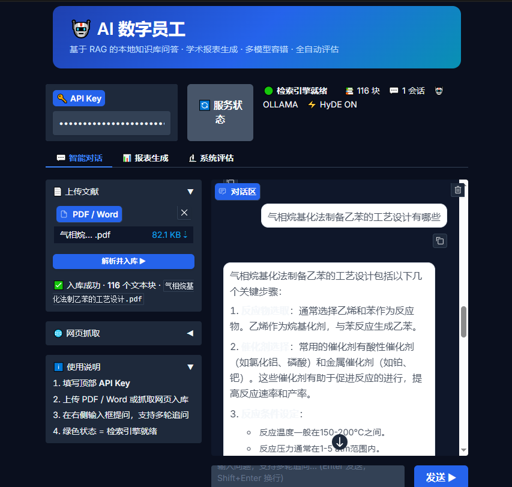
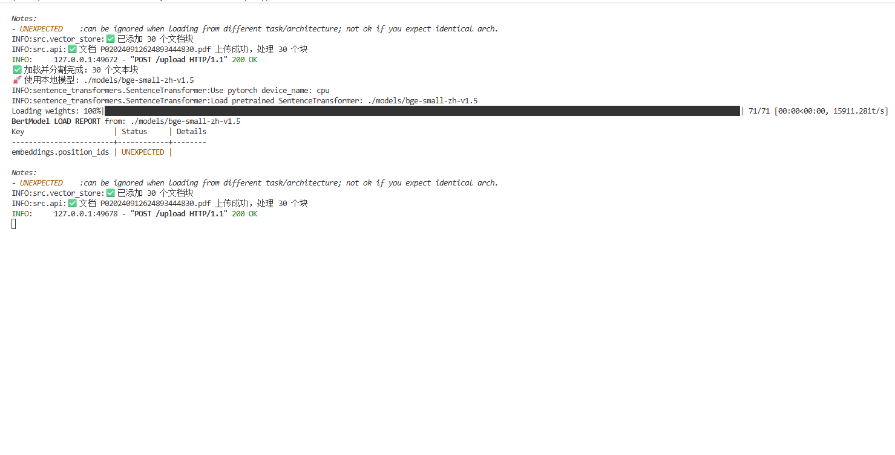

# AI 数字员工 · AI-Digital-Employee-RAG

> 基于 RAG 的本地知识库问答与智能报表生成系统。支持 PDF/Word 上传、网页抓取入库、多轮对话、5 类报表生成、Word 导出、全自动量化评估。

[](https://python.org)
[](https://fastapi.tiangolo.com)
[](https://langchain.com)
[](https://langchain-ai.github.io/langgraph)
[](LICENSE)

## 📸 成果展示

上传 PDF 文献后自动解析入库，基于 RAG 混合检索 + HyDE 增强，对专业问题给出结构化回答：



<p align="center">
  
  
</p>

---

## ✨ 核心功能

| 功能模块 | 说明 |
|---------|------|
| 📄 **文档入库** | 上传 PDF / Word (.docx)，自动解析、分块、向量化存入 Qdrant |
| 🌐 **网页抓取** | 批量输入 URL，自动提取正文并入库，支持多语言自动翻译 |
| 💬 **多轮对话** | 支持 session_id 上下文记忆，LangGraph StateGraph 驱动意图路由 |
| 📊 **报表生成** | 5 类学术报表（摘要 / 要点 / 综述 / 对比分析 / 自定义） |
| 📝 **Word 导出** | 报表一键导出为 .docx，支持标题层级、表格、粗体、列表 |
| 🔬 **自动评估** | 5 项量化指标：语义相似度 / LLM 裁判 / 忠实度 / 相关度 / 耗时百分位 |
| 🔁 **LLM 容错** | DeepSeek 主力 + Ollama 兜底，指数退避自动重试 |
| 📡 **链路追踪** | LangSmith 全链路追踪（可选），审计日志本地持久化 |

---

## 🏗️ 系统架构

```
┌─────────────────────────────────────────────────────────────┐
│                     前端 (Gradio)                            │
│   💬 智能对话      📊 报表生成      🔬 系统评估              │
└────────────────────────┬────────────────────────────────────┘
                         │ HTTP
┌────────────────────────▼────────────────────────────────────┐
│                    后端 (FastAPI)                             │
│                                                              │
│   /ask ──────► LangGraph StateGraph                         │
│                    │                                         │
│         ┌──────────▼──────────┐                             │
│         │   意图分类           │                             │
│         └──┬──────────────┬───┘                             │
│            │ chitchat     │ rag                              │
│            ▼              ▼                                  │
│       闲聊回复        加载历史记忆                            │
│                           │                                  │
│                    ┌──────▼──────┐                           │
│                    │  RAG 检索   │                           │
│                    │  HyDE 增强  │                           │
│                    │  BM25+向量  │                           │
│                    │  FlashRank  │                           │
│                    └──────┬──────┘                           │
│                           │                                  │
│                    ┌──────▼──────┐                           │
│                    │  LLM 生成   │  DeepSeek / Ollama        │
│                    │  +容错重试  │  (自动 Fallback)           │
│                    └──────┬──────┘                           │
│                           │                                  │
│                    保存会话记忆 → 审计日志                    │
│                                                              │
│   /report ───► ReportGenerator (5 类模板)                   │
│   /upload ───► DocumentLoader (PDF + DOCX)                  │
│   /crawl  ───► WebScraper (trafilatura + 翻译)              │
└─────────────────────────────────────────────────────────────┘
                         │
┌────────────────────────▼────────────────────────────────────┐
│                    存储层                                     │
│   Qdrant（向量库）    BM25 索引（内存+磁盘）   审计日志       │
└─────────────────────────────────────────────────────────────┘
```

---

## 🚀 快速开始

### 前提条件

- Python 3.11+
- Docker Desktop（运行状态）
- DeepSeek API Key **或** 本地 Ollama（二选一）

### Step 1：安装依赖

```bash
git clone https://github.com/chublur/AI-Digital-Employee-RAG.git
cd AI-Digital-Employee-RAG

pip install -r requirements.txt
```

### Step 2：下载 Embedding 模型（约 400MB，仅需一次）

```bash
python -c "
from huggingface_hub import snapshot_download
snapshot_download('BAAI/bge-small-zh-v1.5', local_dir='./models/bge-small-zh-v1.5')
"
```

### Step 3：配置环境变量

```bash
cp .env.example .env
```

**最快方式（DeepSeek API）：**

```env
LLM_PROVIDER=deepseek
DEEPSEEK_API_KEY=sk-你的key
API_KEY=任意自定义密钥
```

**纯本地方式（Ollama）：**

```env
LLM_PROVIDER=ollama
OLLAMA_MODEL=qwen2:7b
API_KEY=任意自定义密钥
```

### Step 4：启动基础服务

```bash
# 启动 Qdrant 向量库
docker compose up qdrant -d

# 如使用 Ollama，额外执行：
docker compose up ollama -d
docker exec rag_ollama ollama pull qwen2:7b
```

验证 Qdrant：访问 http://localhost:6333/dashboard

### Step 5：启动应用

```bash
# 终端 1：后端 API
uvicorn src.api:app --reload --port 8000

# 终端 2：前端 UI
python app_gradio.py
```

访问 http://localhost:7860 打开前端界面。

---

## 📡 API 文档

交互式文档：http://localhost:8000/docs

所有写操作需要请求头：`x-api-key: <API_KEY>`

### 核心接口

| 方法 | 路径 | 说明 |
|------|------|------|
| GET | `/health` | 健康检查（含文档数、会话数、组件状态） |
| POST | `/upload` | 上传 PDF / Word 文档入库 |
| POST | `/crawl` | 批量抓取网页入库 |
| GET | `/crawl/history` | 查看已抓取 URL 列表 |
| POST | `/ask` | 多轮问答（支持 session_id） |
| POST | `/report` | 生成学术报表 |
| GET | `/report/types` | 查看可用报表类型 |
| DELETE | `/session/{id}` | 清除指定会话记忆 |
| GET | `/session/stats` | 查看活跃会话统计 |
| POST | `/feedback` | 提交问答反馈（BadCase 记录） |
| POST | `/translate` | 文本翻译 |

### 示例请求

```bash
# 上传文档
curl -X POST http://localhost:8000/upload \
  -H "x-api-key: your-key" \
  -F "file=@论文.pdf"

# 多轮对话
curl -X POST http://localhost:8000/ask \
  -H "x-api-key: your-key" \
  -H "Content-Type: application/json" \
  -d '{"question": "这篇文献的研究方法是什么？", "session_id": "user_001"}'

# 生成报表
curl -X POST http://localhost:8000/report \
  -H "x-api-key: your-key" \
  -H "Content-Type: application/json" \
  -d '{"topic": "深度学习在 NLP 中的应用", "report_type": "review"}'
```

---

## 📊 报表类型

| 类型 | 说明 |
|------|------|
| `summary` | 📄 文献摘要——结构化提炼核心内容 |
| `keypoints` | 🔑 要点提炼——列出关键观点与结论 |
| `review` | 📚 文献综述——综合多篇文献梳理研究脉络 |
| `comparison` | ⚖️ 对比分析——对比不同方法/观点的异同 |
| `custom` | ✏️ 自定义——按指定指令生成报表 |

---

## 🔬 自动化评估

```bash
# 全量评估（含 LLM 裁判）
python evaluate.py --key your-key

# 快速评估（跳过 LLM 裁判，仅用 Embedding 相似度）
python evaluate.py --key your-key --no-llm-judge

# 自定义测试集
python evaluate.py --key your-key --file test/my_cases.json --threshold 0.8
```

**评估指标：**

| 指标 | 说明 |
|------|------|
| `semantic_score` | 语义相似度（Embedding 余弦，0~1） |
| `answer_relevance` | 答案与问题的相关度（0~1） |
| `llm_judge_score` | LLM 裁判评分（0~3，0=错误，3=完全正确） |
| `faithfulness` | 忠实度，量化幻觉程度（0~1） |
| `p50/p90/p99` | 端到端耗时百分位（ms） |

报告保存至 `test/evaluation_report.json`，可在前端「系统评估」页可视化查看。

---

## 🧪 运行测试

```bash
# 全量测试
pytest tests/ -v

# 仅运行评估器测试
pytest tests/test_evaluator.py -v

# 仅运行 Word 导出测试
pytest tests/test_docx_exporter.py -v
```

---

## ⚙️ 配置说明

所有配置通过 `.env` 文件管理，完整参数说明见 `.env.example`。

| 配置项 | 默认值 | 说明 |
|--------|--------|------|
| `LLM_PROVIDER` | `ollama` | LLM 提供商：`ollama` 或 `deepseek` |
| `HYDE_ENABLED` | `true` | HyDE 检索增强（更准但慢 1~3s） |
| `RETRIEVAL_TOP_K` | `10` | 初始检索数量 |
| `RERANK_TOP_K` | `4` | 重排后保留数量 |
| `TRANSLATION_ENABLED` | `false` | 非中文网页自动翻译 |
| `LANGCHAIN_TRACING_V2` | `false` | LangSmith 链路追踪 |

---

## 🗂️ 项目结构

```
.
├── src/
│   ├── api.py              # FastAPI 后端入口
│   ├── rag.py              # RAG 核心：HyDE + 混合检索 + 重排
│   ├── graph.py            # LangGraph StateGraph 问答流程
│   ├── memory.py           # 多轮会话记忆（TTL + 最大轮次）
│   ├── report_generator.py # 5 类学术报表生成器
│   ├── document_loader.py  # PDF / Word 文档解析
│   ├── docx_exporter.py    # Markdown → Word 导出
│   ├── evaluator.py        # AutoEvaluator 自动化评估引擎
│   ├── intent_classifier.py# 意图分类（知识查询 / 操作 / 投诉 / 闲聊）
│   ├── llm_factory.py      # LLM 工厂：Fallback + 指数退避重试
│   ├── web_scraper.py      # 网页正文抓取
│   ├── translator.py       # 多语言翻译
│   ├── audit_log.py        # 审计日志（RotatingFile）
│   ├── vector_store.py     # Qdrant 向量库封装
│   ├── config.py           # 统一配置管理（pydantic-settings）
│   └── tracing.py          # LangSmith 追踪初始化
├── tests/
│   ├── test_evaluator.py   # AutoEvaluator 单元测试（全 Mock）
│   └── test_docx_exporter.py # Word 导出测试
├── app_gradio.py           # Gradio 前端（对话 / 知识库 / 报表 / 评估）
├── evaluate.py             # 全自动评估脚本（CLI）
├── docker-compose.yml      # Qdrant + Ollama 一键启动
├── requirements.txt
└── .env.example
```

---

## 🛠️ 技术栈

| 类别 | 技术 |
|------|------|
| 后端 API | FastAPI + Uvicorn |
| 前端 UI | Gradio |
| 流程编排 | LangGraph StateGraph |
| RAG 框架 | LangChain |
| 大模型 | DeepSeek API / Ollama（本地） |
| 向量数据库 | Qdrant（Docker） |
| Embedding | BAAI/bge-small-zh-v1.5 |
| 混合检索 | 向量检索（60%）+ BM25（40%）|
| 重排序 | FlashrankRerank（ms-marco-MiniLM） |
| 检索增强 | HyDE（Hypothetical Document Embeddings） |
| 文档解析 | PyMuPDF4LLM（PDF）+ python-docx（Word） |
| 网页抓取 | trafilatura |
| LLM 容错 | tenacity 指数退避 + DeepSeek→Ollama Fallback |
| 链路追踪 | LangSmith（可选） |
| 测试 | pytest + unittest.mock |

---

## 📄 License

MIT License © 2026
